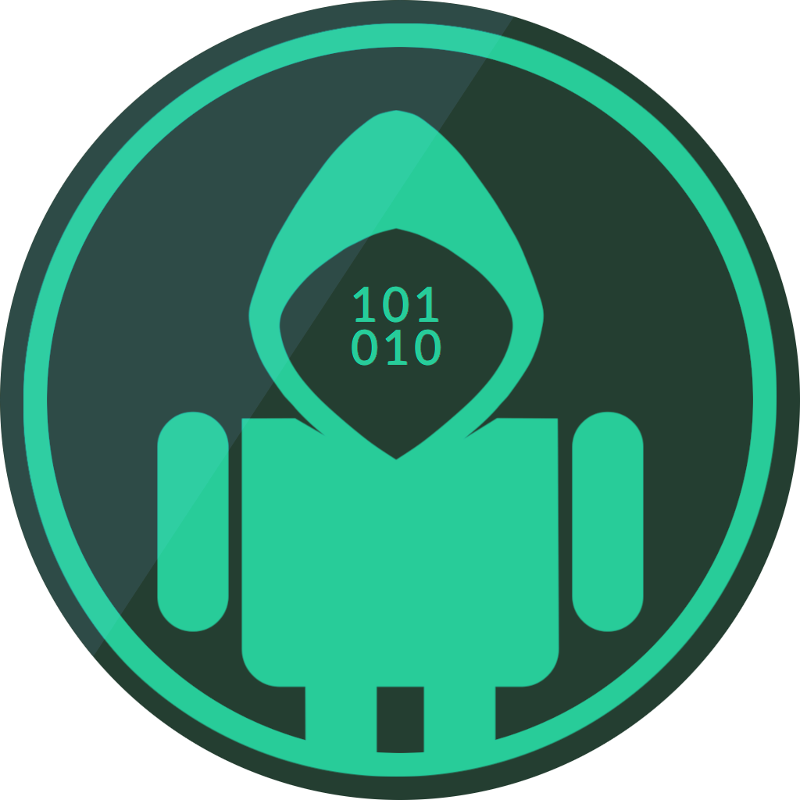
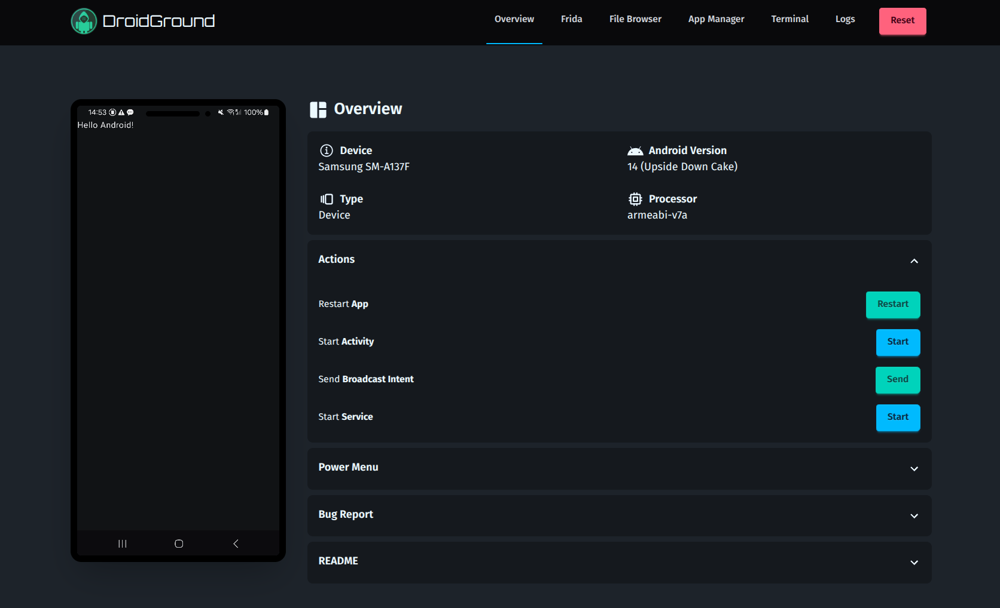
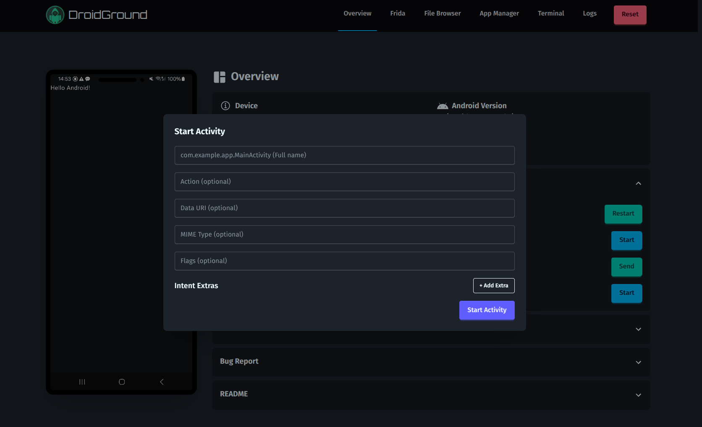
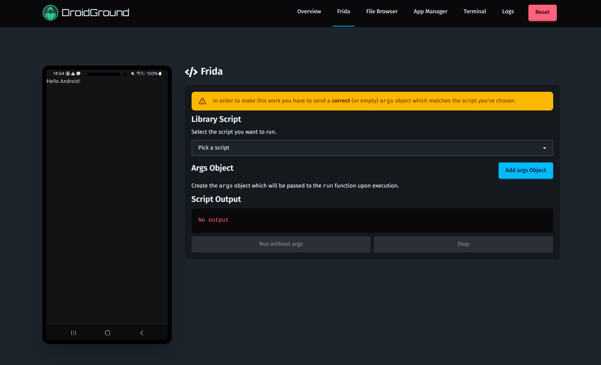
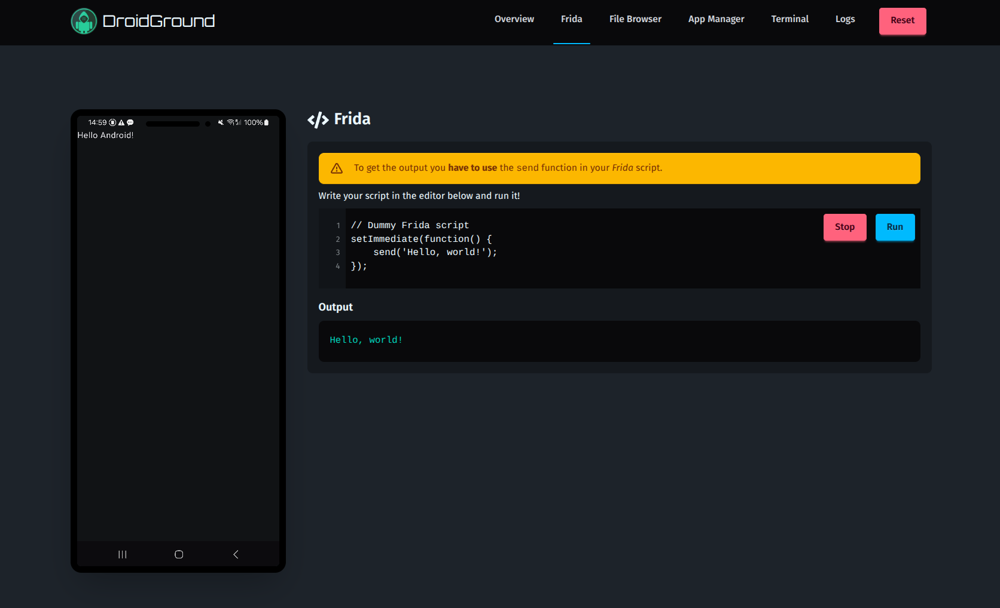
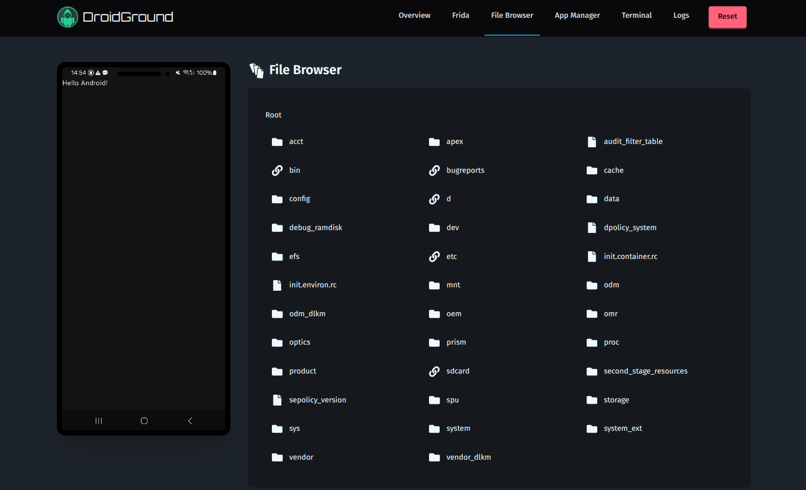
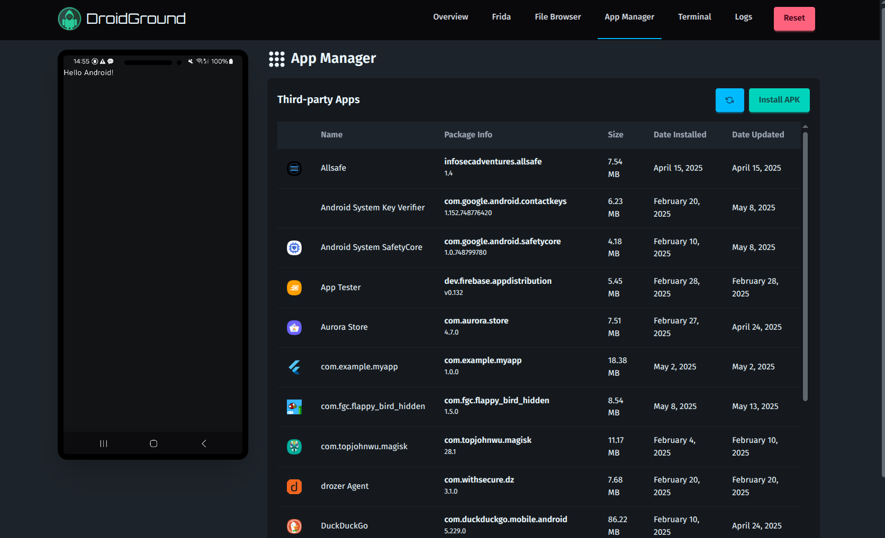
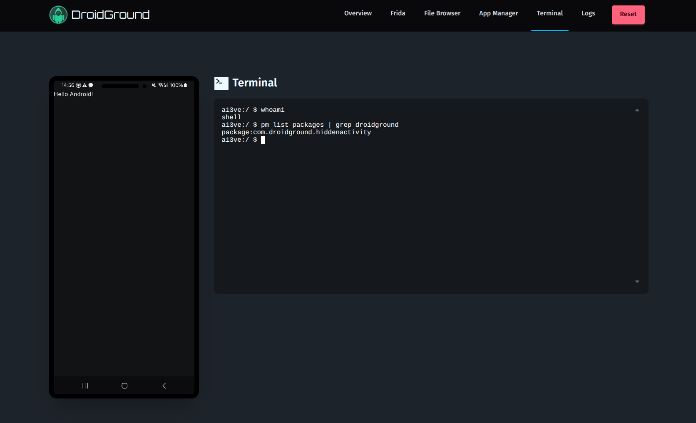
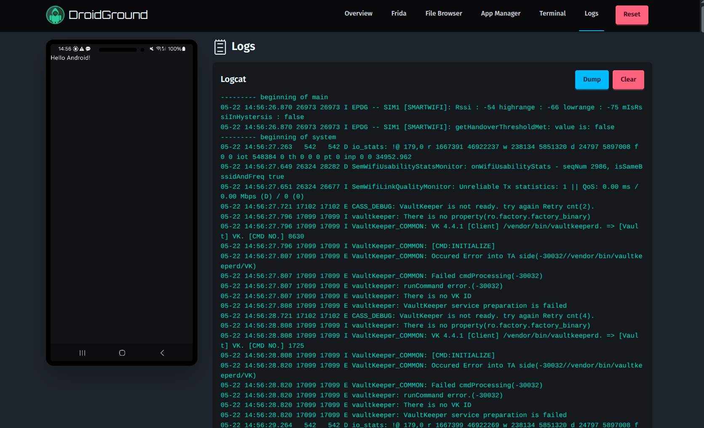

<h1 align="center">
  <br>
    
</h1>
<p align="center">
    <b>DroidGround</b>
<p>

<p align="center">
    <a href="https://github.com/SECFORCE/droidground/blob/main/README.md"></a>
    <a href="https://github.com/SECFORCE/droidground/blob/main/LICENSE"></a>
</p>

In traditional **CTF challenges**, it's common to hide flags in files on a system, requiring attackers to exploit vulnerabilities to retrieve them. However, in the Android world, this approach doesn't work well. APK files are easily downloadable and reversible, so **placing a flag on the device usually makes it trivial** to extract using static analysis or emulator tricks. This severely limits the ability to create realistic, runtime-focused challenges.

_DroidGround_ is designed to solve this problem.

It is a custom-built platform for hosting Android mobile hacking challenges in a **controlled** and **realistic** environment, where **attackers are constrained just enough** to require solving challenges in the intended way.

Importantly, participants may be **jailed inside the app environment**. The modularity of the tool allows to set if the user can or cannot spawn a shell, read arbitrary files, or sideload tools. Everything can be setup so that the only way to retrieve the flag is through understanding and exploiting the app itself.

## 📋 Table of Contents

- [🧭 Overview](#-overview)
- [✨ Features](#-features)
- [📸 Screenshots](#-screenshots)
- [⚙️ Configuration](#️-configuration)
- [🧩 Use Cases](#-use-cases)
- [⚙️ Usage](#️-usage)
- [💡 Tips](#-tips)
- [🛠 Development](#-development)
- [🤝 Contributing](#-contributing)
- [📚 Credits](#-credits)
- [🪪 License](#-license)

## 🧭 Overview

_DroidGround_ enables a wide variety of _Android_ challenges that are otherwise hard to implement in traditional CTF setups. For example, in a remote code execution (RCE) challenge, players might receive an APK for local analysis. After discovering a vulnerability, they can develop a Frida script and run it through DroidGround on the real target device to extract the flag from internal storage. Other challenge types can involve hidden activities, custom broadcast intents, service exploitation, or dynamic analysis using preloaded tools.

With real-time device streaming, fine-grained control over features, Frida integration, and customizable setup and reset scripts, DroidGround empowers CTF organizers to build secure, flexible, and realistic Android challenges that go far beyond what is typically possible.

## ✨ Features

DroidGround provides a rich set of server-controlled features. Most of them can be enabled or disabled per challenge using environment variables:

- **Real-Time Device Screen** (via `scrcpy`)
- **Reset Challenge State**
- **Restart App / Start Activity / Start Service**
- **Send Broadcast Intent**
- **Shutdown / Reboot Device**
- **Download Bugreport (bugreportz)**
- **Frida Scripting**
  - Run from preloaded library (jailed mode)
  - Run arbitrary scripts (full mode)
- **File Browser**
- **Terminal Access**
- **APK Management**
- **Logcat Viewer**

Almost all features are **modular** and defined via environment variables, ensuring precise control over the challenge scope.

## 📸 Screenshots

|               |  |
| ------------------------------------------------------ | ----------------------------------------------------- |
| Overview                                               | Start Activity                                        |
|  |     |
| Frida Jailed Mode                                      | Frida Full Mode                                       |
|       |        |
| File Browser                                           | App Manager                                           |
|               |                    |
| Terminal                                               | Logs                                                  |

## ⚙️ Configuration

The `.env.sample` file in the root directory is a good starting point.

Server-only (prefix `DG_`)

| Variable                 | Description                                        | Default     |
| ------------------------ | -------------------------------------------------- | ----------- |
| `DG_APP_PACKAGE_NAME`    | Package name of target app                         | -           |
| `DG_ADB_HOST`            | ADB host                                           | `localhost` |
| `DG_ADB_PORT`            | ADB port                                           | `5037`      |
| `DG_DEVICE_TYPE`         | `usb` or `network`                                 | `usb`       |
| `DG_DEVICE_HOST`         | IP of Android device (`adb`) (network mode only)   | -           |
| `DG_DEVICE_PORT`         | port of Android device (`adb`) (network mode only) | -           |
| `DG_INIT_SCRIPTS_FOLDER` | Folder containing `setup.sh` and `reset.sh`        | `/init.d`   |

Server + Client (prefix `DROIDGROUND_`)

| Variable                              | Description           | Default   |
| ------------------------------------- | --------------------- | --------- |
| `DROIDGROUND_HOST`                    | Bind address          | `0.0.0.0` |
| `DROIDGROUND_PORT`                    | Bind port             | `4242`    |
| `DROIDGROUND_APP_MANAGER_DISABLED`    | Disable app manager   | `false`   |
| `DROIDGROUND_BUG_REPORT_DISABLED`     | Disable bugreport     | `false`   |
| `DROIDGROUND_FILE_BROWSER_DISABLED`   | Disable file browser  | `false`   |
| `DROIDGROUND_FRIDA_DISABLED`          | Disable Frida support | `false`   |
| `DROIDGROUND_FRIDA_TYPE`              | `jail` or `full`      | `jail`    |
| `DROIDGROUND_LOGCAT_DISABLED`         | Disable logcat        | `false`   |
| `DROIDGROUND_REBOOT_DISABLED`         | Disable reboot        | `false`   |
| `DROIDGROUND_SHUTDOWN_DISABLED`       | Disable shutdown      | `false`   |
| `DROIDGROUND_START_ACTIVITY_DISABLED` | Disable startActivity | `false`   |
| `DROIDGROUND_START_RECEIVER_DISABLED` | Disable broadcast     | `false`   |
| `DROIDGROUND_START_SERVICE_DISABLED`  | Disable startService  | `false`   |
| `DROIDGROUND_TERMINAL_DISABLED`       | Disable terminal      | `false`   |

## 🧩 Use Cases

Here are some ways DroidGround can be used:

1. **Hidden Activity**: Find and launch an unexposed activity to see the flag (player's app contains a dummy flag).
2. **RCE**: The app is vulnerable to RCE and the flag is stored on the device.
3. **Frida Instrumentation**: Overload a method and extract the flag from private memory using a script.

## ⚙️ Usage

A couple of sample _Docker Compose_ files are provided in the [docker](./docker) folder. They are a good starting point, but they also require some work on your end (like setting up the env variables and the init folder with the `setup.sh` and `reset.sh` scripts).

On boot _DroidGround_ does the following:

1. Set up the connection with `adb`
2. Run the `setup.sh` in the folder specified by `DG_INIT_SCRIPTS_FOLDER` if present. This script can be used to install the target app and do everything else that's needed to init the CTF (e.g. placing the flag in a known location)
3. (if _Frida_ is enabled) Download the correct `frida-server` based on the version installed and the architecture of the device and start it
4. Run the target app (the one specified through `DG_APP_PACKAGE_NAME`). If the app is not installed _DroidGround_ will exit.
5. Setup the _REST APIs_, the _WebSocket_ servers and the display streaming

Here is a sample `setup.sh` script:

```sh
#!/usr/bin/env bash

adb shell pm uninstall com.example.app # To do some cleanup
echo "Sleep for 2 seconds before installing app"
sleep 2
echo "Installing app..."
adb install ./flag.apk # The cwd is set to the "init.d" folder, so the apk file can be accessed with the relative path
echo "Install command executed"
```

## 💡 Tips

Here are some suggestions for setting up your Android CTF:

- Be careful when enabling **Frida Full Mode**, the player will have complete control over the device (that's why we made the **Frida Jail Mode** as detailed in [Frida Library](./library)).
- Be careful when enabling the **Terminal**, the player will have complete control over the device.
- Be careful when enabling the **Shutdown** feature.
- If you plan to make the flag directly visible in the UI you may want to find a way to spawn different instances (one for each team/player)

## 🛠 Development

Getting it up & running shouldn't be too difficult, but before starting you should have the following tools installed:

- `frida` (only if you enable _Frida_)
- `node` (it's a Node app, you need to have it!)
- `adb` (well, we rely on it to talk with the device)
- _JDK_ (you need it to build the companion app)

After that you may just run the following:

```sh
git clone https://github.com/SECFORCE/droidground.git
cd droidground
npm run install
```

There is a `postinstall` script which will also try to build it, so if something's missing you'll know pretty soon.

After that you just need to set the **env** variables and then run `npm run dev` and you'll be good to go. Happy dev mode!

## 🤝 Contributing

Pull requests are welcome! Please open an issue first to discuss major changes. Ideas for new CTF workflows or challenge types are especially appreciated.

## 📚 Credits

Developed by Angelo Delicato [@SECFORCE](https://www.secforce.com).

The _server_ section heavily relies on the amazing work done by [@yume-chan](https://github.com/yume-chan/ya-webadb), probably this app wouldn't exist if it wasn't for his amazing work.

The _companion_ app is heavily based on the [aya server](https://github.com/liriliri/aya/tree/master/server) which works the same way as the [scrcpy server](https://github.com/Genymobile/scrcpy) as detailed in the specific [README](./companion/README.md).

## 🪪 License

_DroidGround_ is released under the [GPL-3.0 LICENSE](https://github.com/SECFORCE/droidground/blob/main/LICENSE)
